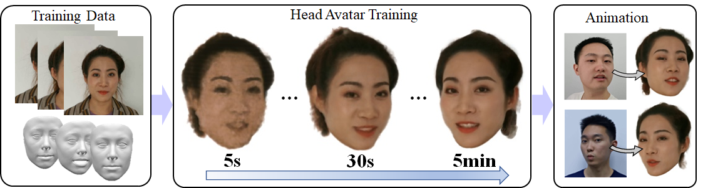

# AvatarMAV: Fast 3D Head Avatar Reconstruction Using Motion-Aware Neural Voxels
## [Paper](https://arxiv.org/abs/2211.13206) | [Project Page](https://liuyebin.com/avatarmav/)
 

## Getting Started
* Create a conda environment `conda env create -f environment.yml`
* Install Pytorch3d `pip install --no-index --no-cache-dir pytorch3d -f https://dl.fbaipublicfiles.com/pytorch3d/packaging/wheels/py38_cu113_pyt1120/download.html`
* Download our dataset [Google drive](https://drive.google.com/file/d/1Hzv41ZkpMK1X9h9Z-B54S-Nn1GcMveb8/view?usp=sharing) and place it in this folder

## Training
```
python train.py
```
During the training process, the intermediate results are saved in the results folder。

## Citation
```
@inproceedings{xu2023avatarmav,
  title={AvatarMAV: Fast 3D Head Avatar Reconstruction Using Motion-Aware Neural Voxels},
  author={Xu, Yuelang and Wang, Lizhen and Zhao, Xiaochen and Zhang, Hongwen and Liu, Yebin},
  booktitle={ACM SIGGRAPH 2023 Conference Proceedings},
  year={2023}
}

```
